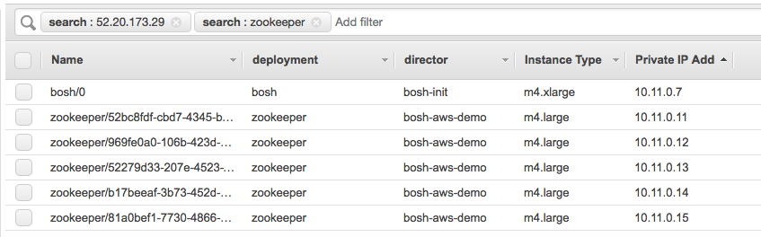

# Ultimate Guide to BOSH

[BOSH](https://bosh.io) is an open source tool for release engineering, deployment, lifecycle management, and monitoring of distributed systems.

It's incredible. Huge companies are using. Tiny companies are using it. You too could be using it.

This is the Ultimate Guide to BOSH.

It will place you in the middle of daily life with BOSH and gradually guide you towards understanding, and then deploying your own systems, and then through to deep understanding. You'll become a raving fan.

# TOC

   * [Ultimate Guide to BOSH](#ultimate-guide-to-bosh)
   * [TOC](#toc)
   * [Introduction](#introduction)
      * [WIP](#wip)
      * [Guide to the guide](#guide-to-the-guide)
      * [Joyful operations](#joyful-operations)
      * [Brief history of BOSH](#brief-history-of-bosh)
      * [BOSH in production](#bosh-in-production)
      * [Why write the Ultimate Guide to BOSH?](#why-write-the-ultimate-guide-to-bosh)
      * [Additional sources of information](#additional-sources-of-information)
   * [What is BOSH?](#what-is-bosh)
      * [What is a running software system?](#what-is-a-running-software-system)
      * [Choose your own deployment level](#choose-your-own-deployment-level)
      * [Assumptions](#assumptions)
      * [Continuous Integration and Continuous Delivery](#continuous-integration-and-continuous-delivery)
   * [Deployments](#deployments)
      * [New deployments](#new-deployments)
      * [New deployments of Zookeeper](#new-deployments-of-zookeeper)
      * [BOSH Architecture, Part 1](#bosh-architecture-part-1)
      * [CPI - the ultimate Cloud Provider Interface abstraction](#cpi---the-ultimate-cloud-provider-interface-abstraction)

NOTE: update TOC using `bin/replace-toc`

# Introduction

## WIP

I recently started writing this. If you're actually reading this guide now, please let me know (I'll actively ask you to review bits as I write them) and please "Watch" this repo. Perhaps I can update it via Github Releases so you can get notifications of new sections or updates. Or better jokes.

## Guide to the guide

This Ultimate Guide to BOSH is to be read linearly. Each section will build upon the preceding sections.

This guide will be a single [README.md](README.md) until that just doesn't make sense anymore.

The guide use sample commands and videos to show you real systems instead of expecting that you can deploy systems yourself on day 1.

Later in the guide you will deploy your own BOSH and use it to deploy systems. At that point you will install the `bosh` command-line tool, and you will need to decide which target cloud infrastructure you will use.


## Joyful operations

You're a professional. You're resourceful. You're a king maker. You keep your organisation in the business of winning.

In past lives you might have been called: developer, sysadmin, or devops.

You're always on the look out for better tools, better mental models, and better systems.

I'm going to show you how I do some day-to-day activities using BOSH. You get to decide if you'd like to level up your superhero status and learn how to do this too. Learning is involved. Effort. New tools. New ecosystem. I definitely think its worth it. Let me know what you decide!

Deploy a 5-node cluster of Zookeeper to Amazon AWS:

```
git clone https://github.com/cppforlife/zookeeper-release
cd zookeeper-release
export BOSH_ENVIRONMENT=aws
export BOSH_DEPLOYMENT=zookeeper
bosh deploy manifests/zookeeper.yml
```


Sanity check that the zookeeper cluster is working:

```
bosh run-errand smoke-tests
```

Upgrade to new version of Zookeeper:

```
git pull
bosh deploy manifests/zookeeper.yml
```

Upgrade the base operating system to push out critical security patches:

```
bosh upload-stemcell https://bosh.io/d/stemcells/bosh-aws-xen-hvm-ubuntu-trusty-go_agent
bosh deploy manifests/zookeeper.yml
```

If Amazon AWS deletes one of your VMs, heal your cluster by receating a new VM, reattach the persistent disk, remount it, and restart all the processes to join the Zookeeper node into the cluster:

```
# do nothing, this resurrection will happen automatically
```

List the health of each Zookeeper server, including disks:

```
bosh instances --vitals
```

SSH into one of the Zookeeper servers to check on something:

```
bosh ssh zookeeper/0
```

Run a command on each Zookeeper server and display results:

```
bosh ssh -c '/var/vcap/jobs/zookeeper/bin/ctl status' -r
```

Tear down your Zookeeper cluster:

```
bosh delete-deployment
```

## Brief history of BOSH

I was fortunate to be invited to the VMWare campus in Palo Alto CA on April 11 2012 for the unveiling of "the Outer Shell" that deploys Cloud Foundry. The Outer Shell was called BOSH. This is an acronym for "BOSH Outer SHell". Engineers know one thing: recursion is funny.

I invited myself to the VMware campus for two days to meet the developers of BOSH and Cloud Foundry and came away fascinated by the vast scope of problems that the BOSH team was trying to solve. The BOSH team were kind enough to either answer a question or fix BOSH so the question was void.

In 2012 I was very publicly excited about BOSH on Twitter ([@drnic](https://twitter.com/drnic)) and I gave presentations at meetups and conferences about BOSH. I also began creating new open source projects to help myself and others to use BOSH and to create new BOSH releases. I also created the first [BOSH Getting Started](https://github.com/cloudfoundry-community-attic/LEGACY-bosh-getting-started) guide.

Many of those early presentations and guides were helpful to the many people who've discovered BOSH and are using it to run production systems at huge scales.

In 2013 the BOSH project was taken over by Pivotal engineering and has been gifted to the Cloud Foundry Foundation to secure its long term success as an open source, open community project. Thanks to Pivotal, IBM and other members of the Cloud Foundry Foundation the BOSH project has received huge consistent investment to this today.

There are many people in the history of BOSH who have directly made BOSH what it is, actively sponsored its investment, or evangelised it.

* James Watters, SVP Product at Pivotal, has been the loudest cheerleader of BOSH on the planet
* Ferran Rodenas, Consultant at Stark & Wayne, has been my BOSH friend since 2012
* Dmitriy Kalinin, Product Manager for BOSH, has been driving his incredible vision for BOSH
* Original BOSH team at VMware - Mark Lucovsky, Vadim Spivak, Oleg Shaldybin, Martin Englund - who had the original vision and execution to create the ultimate tool for release engineering, deployment, lifecycle management, and monitoring of distributed systems.

## BOSH in production

BOSH is the core technology to Pivotal Ops Manager and its Pivotal Network delivery system for complex on-premise software systems. BOSH is the deployment technology used behind the scenes for [Pivotal Web Services](https://run.pivotal.io) which runs upon Amazon AWS.

BOSH is the deployment technology used behind the scenes by [IBM BlueMix](https://www.ibm.com/cloud-computing/bluemix/) on its Soft Layer infrastructure.

BOSH is the deployment technology used by GE [Predix](https://www.predix.io/) which runs on various clouds and data centres.

BOSH is the deployment technology used by Swisscom [appCloud](https://developer.swisscom.com/) which runs inside Swisscom data centres.

These are huge companies who have small teams running huge production systems using BOSH.

On the smaller end - our consultancy [Stark & Wayne](https://www.starkandwayne.com)  - uses BOSH to run a variety of our internal systems across vSphere, Amazon AWS and Google Compute. (The rest of our systems run upon Cloud Foundry itself, such as https://www.starkandwayne.com and https://www.starkandwayne.com/blog).

## Why write the Ultimate Guide to BOSH?

BOSH has been my not-so-secret weapon since 2012. Yet you might not yet be using BOSH.

I don't want to write a book.

I wrote a PhD thesis in 2001 and 6 people read it (two supervisors, three judges, and myself). Fortunately this is enough people to be awarded a doctorate. Unfortunately it doesn't really qualify as "sharing knowledge".

I wrote my first blog post in 2006 and when I quickly reached 7 subscribers I knew I'd found my preferred medium for sharing.

I enjoy the continuous publication and feedback loop of blogging, and of sharing open source projects. I enjoy a relaxed writing style.

I don't want to write a "book" book.

I want to share all the wonders of BOSH with you. I want you to use BOSH. I want you to feel great using BOSH. I want you to feel like a superhero. I want you to convince your friends and colleagues to use BOSH. I want you to help me evangelise BOSH.

I also want you to switch to Queen's English, learn more about Australia, and to use the Oxford comma.

## Additional sources of information

In addition to this Ultimate Guide to BOSH, there are some other sources of factual knowledge and tutorials.

[BOSH documentation website](https://bosh.io/docs/) is very thorough and new features of BOSH now regularly appear simultaneously in this documentation site.

Duncan Winn's [Cloud Foundry: The Definitive Guide](http://shop.oreilly.com/product/0636920042501.do) he includes an entire chapter "BOSH All the Things" towards helping you deploy and operate Cloud Foundry.

Stark & Wayne's own blog (["bosh" tag](https://www.starkandwayne.com/blog/tag/bosh/)) has over fifty articles, tutorials and tiny tips on BOSH.

BOSH is an open source project. You can read the source code and learn how it works. A selection of repositories include:

* https://github.com/cloudfoundry/bosh-cli - the `bosh` CLI
* https://github.com/cloudfoundry/bosh - the BOSH director
* https://github.com/cloudfoundry/bosh-deployment - manifests for various permutations of deploying your own BOSH director

# What is BOSH?

First, let's answer the question:

## What is a running software system?


Your bespoke or user-facing application is either a compiled application (Golang) or source code that runs within an interpreter (Ruby or Python) or is compiled and requires an interpreter (JVM languages).

Your bespoke application will be composed of bespoke code plus third party software libraries (RubyGems for Ruby, NPM for Node, Wheels for Python, etc).

Your application will need to be configured (combination of local configuration files, environment variables, service discovery system) to run and connect to any dependent systems.

Your application will require local dependencies to be already installed - its interpreter, linked libraries, executable applications, etc.

Your application and its dependencies all require an operating system. And formatted disks. And networking to be configured.

All this runs in a virtual server/virtual machines (VMs) either in someone else's data centre called "the cloud" (Amazon AWS, Google Compute, Microsoft Azure) or someone else's data centre called "on premise" (but its really normally not in your building, is it?) running virtualisation software (vSphere, OpenStack).

Your applications and databases running on virtual machines will require disks: local or ephemeral disks that might not survive VM downtime or replacement; and persistent networked disks that are independent of each VM and will be available again if you need (or are forced) to replace your VMs.

All of this runs upon physical machines connected to actual storage systems and interconnected by real-world networking.

Servers need to be powered, so you'll need stable affordable electricity. Servers get hot, so you'll need cooling. Servers can be stolen or physically hacked, so you'll need security guards with appropriate lapel badges.

It's incredible that it all works. Click on https://google.com to check that it all works.

Note: The Ultimate Guide to BOSH will include unsolicited sarcasm and humour. With luck, you'll enjoy both the Ultimate Guide BOSH and the humour.

## Choose your own deployment level

You might define "deploying my system" at a different level to other people:

* using an application platform, such as Cloud Foundry or Heroku
* using a container orchestration system provided by someone else, such as Kubernetes, Docker, Amazon ECS
* using virtual machines provided by someone else, such as Amazon AWS, Google Compute, vSphere
* using bare metal machines provided by someone else
* racking bare metal servers or putting Raspberry Pis into the field

From the perspective of your organisation and their goals of efficiently using your time and energy,
hopefully you can start as high up this stack as possible. For example, there is simply nothing faster, more time efficient, and UI consistent as `cf push`-ing an application to any Cloud Foundry. Every system you deploy should have to first justify why it cannot be deployed to Cloud Foundry or Heroku or Google App Engine.

If you do need to "go down the stack" and take responsibility for more then you will need more help. Either your organisation will need to expect less from you and your team, or you'll need more tooling, automation, and education.

## Assumptions

The Ultimate Guide to BOSH assumes you need the latter: you need tooling, automation and education.

It also assumes that you have direct access to your virtualisation/cloud infrastructure - you have suitable AWS credentials, or a Google Compute account or vSphere admin access.

The Ultimate Guide to BOSH assumes you are prepared to learn a new tool, its features, and its quirks.

## Continuous Integration and Continuous Delivery

BOSH slots in very nicely into any continuous deployment systems you might already be using. The `bosh` command-line tool is a perfect abstraction for "please make this happen" that will make it pleasurable to move BOSH deployments into your CI/CD systems.

# Deployments

Let's begin!

The highest level concept of BOSH is the "deployment" of a system. The purpose of BOSH is to continuous run one or more deployments. For example, a cluster of servers that form a Zookeeper cluster is a deployment of the Zookeeper system.

In [Joyful operations](#joyful-operations) we began by creating a deployment:

```
export BOSH_DEPLOYMENT=zookeeper
bosh deploy manifests/zookeeper.yml
```

And we finished the lifecycle of that system by deleting the BOSH deployment:

```
bosh delete-deployment
```

## New deployments

When we ask BOSH to provision a new system, BOSH takes upon the entire responsibility for making this happen:

* BOSH will communicate with your cloud infrastructure API to request new servers/virtual machines (called "instances")
* BOSH manages the base machine image used for each virtual machine (called "stemcells")
* BOSH will allocate an available IP address for each instance
* BOSH will communicate with your cloud infrastructure API to request persistent disk volumes (we will see soon that the `zookeeper.yml` manifest requires a persistent disk volume for each instance in the deployment)
* BOSH will request that the disk volumes are attached to the instances

Once the instances are provisioned and the disks are attached, BOSH then starts communicating with each instance:

* BOSH will format disk volumes if necessary
* BOSH will download the software required (called "packages")
* BOSH will construct configuration files for the packages and commence running the software (called "job templates")
* BOSH provides service discovery information to each job template about the location and credentials of other instances (called "links")

At this point, it becomes the installed software's responsibility to do thing that it needs to do. It now has been given a brand new instance running on a hardened base operating system, with a mounted persistent disk for it to store data, and has been configured with the information for forming a cluster with its peers, and connecting as a client to any other systems.

## New deployments of Zookeeper

Let's revisit each of these actions for the specific case of our 5-instance deployment of Zookeeper running on Amazon AWS.

```
export BOSH_DEPLOYMENT=zookeeper
bosh deploy manifests/zookeeper.yml
```

Inside `zookeeper.yml` is the description of an group of five instances, each with a 10GB persistent disk volume (we will review the contents of this file soon).

* BOSH sends requests to Amazon AWS API for five EC2 VMs, using a specified Amazon Machine Image (AMI) as the base file system/operating system
* BOSH will manage the allocation of IPs within the VPC subnet rather than using DHCP (more on networking later)
* BOSH sends requests to AWS for five EBS volumes and then attaches each one to a different EC2 VM

Each of the AWS EC2 VMs will eventually "call home" to BOSH saying that they are awake and ready.

BOSH then begins preparing them for their role of "Zookeeper" instance.

* BOSH downloads special BOSH packages of Apache Zookeeper, plus the Java JDK which is a dependency for running Zookeeper.
* BOSH downloads special BOSH job templates that describe how to configure and run a single node of Zookeeper on each instance
* BOSH provides each Zookeeper job template with the IP address, client port, quorum port and leader election port for every other member of the deployment (these are Zookeeper specific requirements to for a cluster of Zookeeper instances)

## BOSH Architecture, Part 1

In the previous sections I've made reference to a `bosh` CLI but have otherwise danced around the topic of "what is BOSH really?"

From now onwards I will stop simplistically saying "BOSH does a thing" and start to be consistently discerning about which aspect of BOSH is doing something.

Right now think of BOSH as three things:

* BOSH CLI - the `bosh` command being referenced in the earlier examples. The CLI is a client to the:
* BOSH director - an HTTP API that receives requests from the CLI and either communicates directly with instances or with your cloud infrastructure. Communication with your cloud infrastructure is via a:
* Cloud Provider Interface (CPI) - the specific implementation of how a BOSH director communicates with Amazon AWS, Google Compute, vSphere, OpenStack or any other target.

## CPI - the ultimate Cloud Provider Interface abstraction

The CLI, the director and a CPI are the basic components that bring a deployment to life on your target cloud infrastructure.

For our Zookeeper example, we began with:

```
bosh deploy manifests/zookeeper.yml
```

The BOSH CLI loads the `zookeeper.yml` file from your local machine (which originally came from a [Github repository](https://github.com/cppforlife/zookeeper-release/blob/master/manifests/zookeeper.yml) in the [Joyful operations](#joyful-operations) section above).

The BOSH CLI forwards this file on to the BOSH director.

The BOSH director decides that it is a new deployment (it has a name that the BOSH director does not know yet). The BOSH director decides it needs to provision five new virtual machines and five persistent disks (we will investigate the contents of `zookeeper.yml` soon). The BOSH director delegates this activity to the BOSH CPI for Amazon AWS (where we are attempting to deploy Zookeeper in our example).

The BOSH CPI is a local command line application hosted inside the BOSH director. You will never need to touch it or find it or run it manually. But it can be helpful to understand its nature. A CPI - the abstraction for how an BOSH director can interact with any cloud infrastructure - is just a CLI. The BOSH director - a long-running HTTP API process - calls out to the CPI executable and invokes commands using a JSON payload. When the CPI completes its task - creating a VM, creating a disk, etc - it will return JSON with success/failure information.

For Zookeeper running on Amazon AWS, our BOSH director will be running with the AWS CPI CLI (TLA BINGO - three three letter acronyms in a row) installed on the same server. The combination of the BOSH director and a collocated CPI CLI is the magic of how a BOSH director can be configured to communicate with any cloud infrastructure.  The CPI CLIs can be written in different programming languages than BOSH director, and be maintained by different engineering teams at different companies. It is a wonderfully powerful design pattern.

This will be the last we will reference the CPIs for a long time. They exist. They allow a BOSH director to interact with any cloud infrastructure. There are many of them already implemented (Amazon AWS, Google Compute Platform, Microsoft Azure, VMWare vSphere, OpenStack, IBM SoftLayer, VirtualBox, Warden/Garden, Docker).

And you will mostly never need to know about them.

Here is the command for deploying five Amazon EC2 servers running Zookeeper, backed by Amazon EBS volumes, running inside Amazon VPC networking:

```
bosh deploy manifests/zookeeper.yml
```

In the Amazon AWS console, your list of EC2 servers (including the BOSH director VM) might look like:



Here is the command for deploying five Google Compute VM Instances, backed by Google Compute Disks, running inside GCP networking, installed and configured to be a Zookeeper cluster:

```
bosh deploy manifests/zookeeper.yml
```

In the Google Compute Platform console, your list of VM instances (including a NAT VM, bastion VM, and BOSH director VM) might look like:


Never used VMWare vSphere before? Here is the command for deploying a five ESXi virtual machines using a concept of persistent disks, on any cluster of physical servers in the world. And they will be Zookeeper:

```
bosh deploy manifests/zookeeper.yml
```

In VMWare vCenter your deployment will not specifically look like anything. vSphere is a crazy mess to me.

For sure there are distinctions in deploying any system to any infrastructure that need to be made, but the command above is valid and will work once we have a running BOSH director configured with a CPI. That's fantastic.
