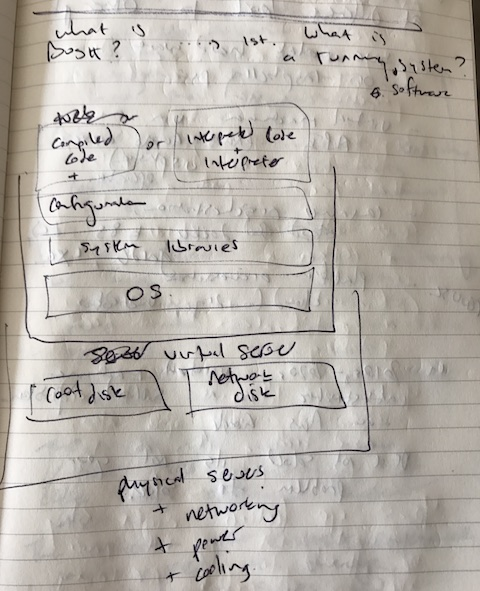

# Ultimate Guide to BOSH

[BOSH](https://bosh.io) is an open source tool for release engineering, deployment, lifecycle management, and monitoring of distributed systems.

It's incredible. Huge companies are using. Tiny companies are using it. You too could be using it.

This is the Ultimate Guide to BOSH.

It will place you in the middle of daily life with BOSH and gradually guide you towards understanding, and then deploying your own systems, and then through to deep understanding. You'll become a raving fan.

## Introduction

### TOC

   * [Ultimate Guide to BOSH](#ultimate-guide-to-bosh)
      * [Introduction](#introduction)
         * [TOC](#toc)
         * [WIP](#wip)
         * [Guide to the guide](#guide-to-the-guide)
      * [Joyful operations](#joyful-operations)
      * [Why the Ultimate Guide to BOSH?](#why-the-ultimate-guide-to-bosh)
         * [Brief history of BOSH](#brief-history-of-bosh)
         * [BOSH in production](#bosh-in-production)
         * [Why write the Ultimate Guide to BOSH?](#why-write-the-ultimate-guide-to-bosh)
      * [What is BOSH?](#what-is-bosh)
         * [What is a running software system?](#what-is-a-running-software-system)
         * [Choose your own deployment level](#choose-your-own-deployment-level)

NOTE: update TOC using `bin/replace-toc`

### WIP

I recently started writing this. If you're actually reading this guide now, please let me know (I'll actively ask you to review bits as I write them) and please "Watch" this repo. Perhaps I can update it via Github Releases so you can get notifications of new sections or updates. Or better jokes.

### Guide to the guide

This guide is to be read linearly. Each section will add to the preceding sections.

I'll use videos to show you real systems instead of expecting that you can deploy systems yourself on day 1. Eventually you'll feel comfortable and doing it yourself will be easy.

This guide will be a single [README.md](README.md) until that just doesn't make sense anymore.

## Joyful operations

You're a professional. You're resourceful. You're a king maker. You keep your organisation in the business of winning.

In past lives you might have been called: developer, sysadmin, or devops.

You're always on the look out for better tools, better mental models, and better systems.

I'm going to show you how I do some day-to-day activities using BOSH. You get to decide if you'd like to level up your superhero status and learn how to do this too. Learning is involved. Effort. New tools. New ecosystem. I definitely think its worth it. Let me know what you decide!

Deploy a 5-node cluster of Zookeeper to Amazon AWS:

```
git clone https://github.com/cppforlife/zookeeper-release
cd zookeeper-release
export BOSH_ENVIRONMENT=aws
export BOSH_DEPLOYMENT=zookeeper
bosh deploy manifests/zookeeper.yml
```


Sanity check that the zookeeper cluster is working:

```
bosh run-errand smoke-tests
```

Upgrade to new version of Zookeeper:

```
git pull
bosh deploy manifests/zookeeper.yml
```

Upgrade the base operating system to push out critical security patches:

```
bosh upload-stemcell https://bosh.io/d/stemcells/bosh-aws-xen-hvm-ubuntu-trusty-go_agent
bosh deploy manifests/zookeeper.yml
```

If Amazon AWS deletes one of your VMs, heal your cluster by receating a new VM, reattach the persistent disk, remount it, and restart all the processes to join the Zookeeper node into the cluster:

```
# do nothing, this resurrection will happen automatically
```

List the health of each Zookeeper server, including disks:

```
bosh instances --vitals
```

SSH into one of the Zookeeper servers to check on something:

```
bosh ssh zookeeper/0
```

Run a command on each Zookeeper server and display results:

```
bosh ssh -c '/var/vcap/jobs/zookeeper/bin/ctl status' -r
```

Tear down your Zookeeper cluster:

```
bosh delete-deployment
```

## Why the Ultimate Guide to BOSH?

### Brief history of BOSH

I was fortunate to be invited to the VMWare campus in Palo Alto CA on April 11 2012 for the unveiling of "the Outer Shell" that deploys Cloud Foundry. The Outer Shell was called BOSH. This is an acronym for "BOSH Outer SHell". Engineers know one thing: recursion is funny.

I invited myself to the VMware campus for two days to meet the developers of BOSH and Cloud Foundry and came away fascinated by the vast scope of problems that the BOSH team was trying to solve. The BOSH team were kind enough to either answer a question or fix BOSH so the question was void.

In 2012 I was very publicly excited about BOSH on Twitter ([@drnic](https://twitter.com/drnic)) and I gave presentations at meetups and conferences about BOSH. I also began creating new open source projects to help myself and others to use BOSH and to create new BOSH releases. I also created the first [BOSH Getting Started](https://github.com/cloudfoundry-community-attic/LEGACY-bosh-getting-started) guide.

Many of those early presentations and guides were helpful to the many people who've discovered BOSH and are using it to run production systems at huge scales.

In 2013 the BOSH project was taken over by Pivotal engineering and has been gifted to the Cloud Foundry Foundation to secure its long term success as an open source, open community project. Thanks to Pivotal, IBM and other members of the Cloud Foundry Foundation the BOSH project has received huge consistent investment to this today.

There are many people in the history of BOSH who have directly made BOSH what it is, actively sponsored its investment, or evangelised it.

* James Watters, SVP Product at Pivotal, has been the loudest cheerleader of BOSH on the planet
* Ferran Rodenas, Consultant at Stark & Wayne, has been my BOSH friend since 2012
* Dmitriy Kalinin, Product Manager for BOSH, has been driving his incredible vision for BOSH
* Original BOSH team at VMware - Mark Lucovsky, Vadim Spivak, Oleg Shaldybin, Martin Englund - who had the original vision and execution to create the ultimate tool for release engineering, deployment, lifecycle management, and monitoring of distributed systems.

### BOSH in production

BOSH is the core technology to Pivotal Ops Manager and its Pivotal Network delivery system for complex on-premise software systems. BOSH is the deployment technology used behind the scenes for [Pivotal Web Services](https://run.pivotal.io) which runs upon Amazon AWS.

BOSH is the deployment technology used behind the scenes by [IBM BlueMix](https://www.ibm.com/cloud-computing/bluemix/) on its Soft Layer infrastructure.

BOSH is the deployment technology used by GE [Predix](https://www.predix.io/) which runs on various clouds and data centres.

BOSH is the deployment technology used by Swisscom [appCloud](https://developer.swisscom.com/) which runs inside Swisscom data centres.

These are huge companies who have small teams running huge production systems using BOSH.

On the smaller end - our consultancy [Stark & Wayne](https://www.starkandwayne.com)  - uses BOSH to run a variety of our internal systems across vSphere, Amazon AWS and Google Compute. (The rest of our systems run upon Cloud Foundry itself, such as https://www.starkandwayne.com and https://www.starkandwayne.com/blog).

### Why write the Ultimate Guide to BOSH?

BOSH has been my not-so-secret weapon since 2012. Yet you might not yet be using BOSH.

I don't want to write a book.

I wrote a PhD thesis in 2001 and 6 people read it (two supervisors, three judges, and myself). Fortunately this is enough people to be awarded a doctorate. Unfortunately it doesn't really qualify as "sharing knowledge".

I wrote my first blog post in 2006 and when I quickly reached 7 subscribers I knew I'd found my preferred medium for sharing.

I enjoy the continuous publication and feedback loop of blogging, and of sharing open source projects. I enjoy a relaxed writing style.

I don't want to write a "book" book.

I want to share all the wonders of BOSH with you. I want you to use BOSH. I want you to feel great using BOSH. I want you to feel like a superhero. I want you to convince your friends and colleagues to use BOSH. I want you to help me evangelise BOSH.

I also want you to switch to Queen's English, learn more about Australia, and to use the Oxford comma.


## What is BOSH?

First, let's answer the question:

### What is a running software system?



Your bespoke or user-facing application is either a compiled application (Golang) or source code that runs within an interpreter (Ruby or Python) or is compiled and requires an interpreter (JVM languages).

Your bespoke application will be composed of bespoke code plus third party software libraries (RubyGems for Ruby, NPM for Node, Wheels for Python, etc).

Your application will need to be configured (combination of local configuration files, environment variables, service discovery system) to run and connect to any dependent systems.

Your application will require local dependencies to be already installed - its interpreter, linked libraries, executable applications, etc.

Your application and its dependencies all require an operating system. And formatted disks. And networking to be configured.

All this runs in a virtual server/virtual machines (VMs) either in someone else's data centre called "the cloud" (Amazon AWS, Google Compute, Microsoft Azure) or someone else's data centre called "on premise" (but its really normally not in your building, is it?) running virtualisation software (vSphere, OpenStack).

Your applications and databases running on virtual machines will require disks: local or ephemeral disks that might not survive VM downtime or replacement; and persistent networked disks that are independent of each VM and will be available again if you need (or are forced) to replace your VMs.

All of this runs upon physical machines connected to actual storage systems and interconnected by real-world networking.

Servers need to be powered, so you'll need stable affordable electricity. Servers get hot, so you'll need cooling. Servers can be stolen or physically hacked, so you'll need security guards with appropriate lapel badges.

It's incredible that it all works. Click on https://google.com to check that it all works.

Note: The Ultimate Guide to BOSH will include unsolicited sarcasm and humour. With luck, you'll enjoy both the Ultimate Guide BOSH and the humour.

### Choose your own deployment level

You might define "deploying my system" at a different level to other people:

* using an application platform, such as Cloud Foundry or Heroku
* using a container orchestration system provided by someone else, such as Kubernetes, Docker, Amazon ECS
* using virtual machines provided by someone else, such as Amazon AWS, Google Compute, vSphere
* using bare metal machines provided by someone else
* racking bare metal servers or putting Raspberry Pis into the field

From the perspective of your organisation and their goals of efficiently using your time and energy,
hopefully you can start as high up this stack as possible. For example, there is simply nothing faster, more time efficient, and UI consistent as `cf push`-ing an application to any Cloud Foundry. Every system you deploy should have to first justify why it cannot be deployed to Cloud Foundry.
