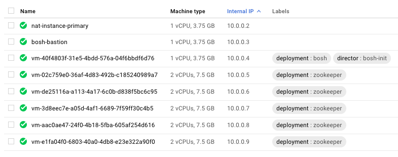

# Deployments

Let's begin!

The highest level concept of BOSH is the "deployment" of a system. The purpose of BOSH is to continuously run one or more deployments. For example, a cluster of servers that form a ZooKeeper cluster is a deployment of the ZooKeeper system.

In [Joyful operations](/introduction/#joyful-operations) we began by creating a deployment:

```
> export BOSH_DEPLOYMENT=zookeeper
> bosh deploy zookeeper-release/manifests/zookeeper.yml
```

And we finished the lifecycle of that system by deleting the BOSH deployment:

```
> bosh delete-deployment
```

## New Deployments

When we ask BOSH to provision a new system, BOSH takes upon the entire responsibility for making this happen:

* BOSH will communicate with your cloud infrastructure API to request new servers/virtual machines (called "instances")
* BOSH manages the base machine image used for each virtual machine (called "stemcells")
* BOSH will allocate an available IP address for each instance
* BOSH will communicate with your cloud infrastructure API to request persistent disk volumes (we will see soon that the `zookeeper.yml` manifest requires a persistent disk volume for each instance in the deployment)
* BOSH will request that the disk volumes are attached to the instances

Once the instances are provisioned and the disks are attached, BOSH then starts communicating with each instance:

* BOSH will format disk volumes if necessary
* BOSH will download the software required (called "packages")
* BOSH will construct configuration files for the packages and commence running the software (called "job templates")
* BOSH provides service discovery information to each job template about the location and credentials of other instances (called "links")

At this point, it becomes the installed software's responsibility to do things that it needs to do. It now has been given a brand new instance running on a hardened base operating system, with a mounted persistent disk for it to store data, and has been configured with the information for forming a cluster with its peers, and connecting as a client to any other systems.

## New Deployments of ZooKeeper

Let's revisit each of these actions for the specific case of our 5-instance deployment of ZooKeeper running on AWS.

```
> export BOSH_DEPLOYMENT=zookeeper
> bosh deploy zookeeper-release/manifests/zookeeper.yml
```

Inside `zookeeper.yml` is the description of a group of five instances, each with a 10GB persistent disk volume (we will review the contents of this file soon).

* BOSH sends requests to AWS API for five EC2 VMs, using a specified Amazon Machine Image (AMI) as the base file system/operating system
* BOSH will manage the allocation of IPs within the VPC subnet rather than using DHCP (more on networking later)
* BOSH sends requests to AWS for five EBS volumes and then attaches each one to a different EC2 VM

Each of the AWS EC2 VMs will eventually "call home" to BOSH saying that they are awake and ready.

BOSH then begins preparing them for their role of "ZooKeeper" instance.

* BOSH downloads special BOSH packages of Apache ZooKeeper, plus the Java JDK which is a dependency for running ZooKeeper.
* BOSH downloads special BOSH job templates that describe how to configure and run a single node of ZooKeeper on each instance
* BOSH provides each ZooKeeper job template with the IP address, client port, quorum port and leader election port for every other member of the deployment (these are ZooKeeper specific requirements for a cluster of ZooKeeper instances)

## BOSH Architecture, Part 1

In the previous sections, I've made reference to a `bosh` CLI but have otherwise danced around the topic of, "What is BOSH really?"

From now onward, I will stop simplistically saying, "BOSH does a thing," and start to be consistently discerning about which aspect of BOSH is doing something.

Right now think of BOSH as three things:

* BOSH CLI - the `bosh` command being referenced in the earlier examples. The CLI is a client to the:
* BOSH director - an HTTP API that receives requests from the CLI and either communicates directly with instances or with your cloud infrastructure. Communication with your cloud infrastructure is via a:
* Cloud Provider Interface (CPI) - the specific implementation of how a BOSH director communicates with AWS, GCP, vSphere, OpenStack, or any other target.

## CPI - The Ultimate Cloud Provider Interface Abstraction

The CLI, the director, and a CPI are the basic components that bring a deployment to life on your target cloud infrastructure.

For our ZooKeeper example, we began with:

```
> bosh deploy zookeeper-release/manifests/zookeeper.yml
```

The BOSH CLI loads the `zookeeper.yml` file from your local machine (which originally came from a [Github repository](https://github.com/cppforlife/zookeeper-release/blob/master/manifests/zookeeper.yml) in the [Joyful operations](/introduction/#joyful-operations) section above).

The BOSH CLI forwards this file on to the BOSH director.

The BOSH director decides that it is a new deployment (it has a name that the BOSH director does not know yet). The BOSH director decides it needs to provision five new virtual machines and five persistent disks (we will investigate the contents of `zookeeper.yml` soon). The BOSH director delegates this activity to the BOSH CPI for AWS (where we are attempting to deploy ZooKeeper in our example).

The BOSH CPI is a local command line application hosted inside the BOSH director. You will never need to touch it, find it, or run it manually. But it can be helpful to understand its nature. A CPI - the abstraction for how a BOSH director can interact with any cloud infrastructure - is just a CLI. The BOSH director - a long-running HTTP API process - calls out to the CPI executable and invokes commands using a JSON payload. When the CPI completes its task - creating a VM, creating a disk, etc - it will return JSON with success/failure information.

For ZooKeeper running on AWS, our BOSH director will be running with the AWS CPI CLI (TLA BINGO - three, three letter acronyms in a row) installed on the same server. The combination of the BOSH director and a collocated CPI CLI is the magic of how a BOSH director can be configured to communicate with any cloud infrastructure. The CPI CLIs can be written in different programming languages than BOSH director, and be maintained by different engineering teams at different companies. It is a wonderful, powerful design pattern.

This will be the last time we will reference the CPIs for a long time. They exist. They allow a BOSH director to interact with any cloud infrastructure. There are many of them already implemented (AWS, Google Compute Platform, Microsoft Azure, VMWare vSphere, OpenStack, IBM SoftLayer, VirtualBox, Warden/Garden, Docker).

And you will mostly never need to know about them.

Here is the command for deploying five Amazon EC2 servers running ZooKeeper, backed by Amazon EBS volumes, running inside Amazon VPC networking:

```
> bosh deploy zookeeper-release/manifests/zookeeper.yml
```

In the AWS console, your list of EC2 servers (including the BOSH director VM) might look like:


Here is the command for deploying five Google Compute VM Instances, backed by Google Compute Disks, running inside GCP networking, installed and configured to be a ZooKeeper cluster:

```
> bosh deploy zookeeper-release/manifests/zookeeper.yml
```

In the Google Cloud Platform console, your list of VM instances (including a NAT VM, bastion VM, and BOSH director VM) might look like:



Never used VMWare vSphere before? Here is the command for deploying five ESXi virtual machines using a concept of persistent disks, on any cluster of physical servers in the world. And they will be ZooKeeper:

```
> bosh deploy zookeeper-release/manifests/zookeeper.yml
```

In VMWare vCenter, your deployment will not specifically look like anything. vSphere is a crazy mess to me.

For sure there are distinctions in deploying any system to any infrastructure that need to be made, but the command above is valid and will work once we have a running BOSH director configured with a CPI. That's fantastic.
